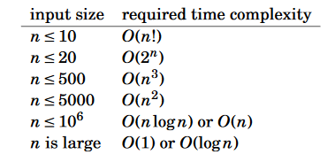

Chapter 2: Time complexity
===
 * Time complexity = How long program takes depending on input size

Calculation
---
 * Only care about highest order of magnitude part of program
 * Recursion = time complexity of each call * # of calls

Complexity classes
---
 * O(1) < O(logn) < O(sqrt(n)) < O(2n) < O(n!)

Estimation
---
 * Easy to estimate based on time constraint and input size
 * 
 * Important to note that estimation relies on constant factor, i.e. 5n = .5n = n

Maximum subarray sum
---
 * Easy to make O(n3) algorithm by just iterating through all possible subarrays
 * O(n2) algorithm removes a loop by adding to sum when right increments, reset sum every outer loop
 * O(n) solution is a DP-like algorithm that resets sum if sum+array[i] is less than array[i].

