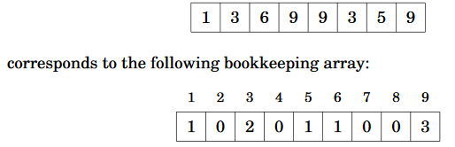

Chapter 3: Sorting
===
 * Sorting is a great algorithmic design technique example due to multiple ways of implementing, time complexities, objectives, etc.
 * Given an array of <i>n</i> elements, return array in where elements are in increasing order

Algorithms
---
 * <b>Bubble sort</b> consists of n rounds. On each round, the algorithm iteratesthrough the elements of the array. Whenever two consecutive elements are foundthat are not in correct order, the algorithm swaps them. Bubble sort is O(n2
 * ~~~c++
	for (int i = 0; i < n; i++) {
		for (int j = 0; j < n-1; j++) {
			if (array[j] > array[j+1]) {
				swap(array[j],array[j+1]);
			}
		}
	}
   ~~~
 * Inversion = A pair of elements that are out of order
 * IMPORTANT: <b>Merge sort</b> is a divide and conquer algorithm. It splits the array recursively down to sizes of 1, then sorts each half coming back up from the recursion. Merge sort is O(nlogn).
 * IMPORTANT: <b>Counting sort</b> uses a bookkeeping array that keeps track of indices. I actually implemented this in LC #75 (Sort Colors). Counting sort is O(n).
 * 

C++ Sort
---
 * `sort()` requires address bounds. To sort an array, use `sort(a, a+n)`. 
 * Pairs (`pair<int,int>`) are sorted based on first element with 2nd as tiebreaker.
 * Override the operator< in order to use sort with structs!
 * Use a comparison function via `sort(a, a+n, comp)`.

Binary Search
--- 
 * Searching through an array is normally O(n). If array is sorted, then it can be O(logn) with binary search.
 * <b>Binary search</b> can be done using 
 * ~~~c++
	int k = 0; 
	for (int b = n/2; b >= 1; b /= 2) {
		while (k+b < n && array[k+b] <= x) 
			k += b;
	} 
   ~~~
 * `lower_bound`, `upper_bound`, and `equal_range` all search a sorted array and employ binary search.
 * Can be used to find the smallest/largest solution in our array of solutions!
