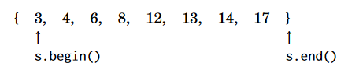

Chapter 4: Data Structures
===
 * This chapter goes over C++ data structures

Dynamic array
---
 * Vectors are used as dynamic arrays 
 * `v.back()` gets last element
 * `v.pop_back` remove and return back element
 * `vector<int> v(10, 5)` initializes vector of size 10 with value 5
 * Use `str.substr(x, y)` to get a substring at x with y length
 * `str.find(x)` finds first occurence of substring x

Set structures
---
 * Two set architectures: unordered_set uses hashing and set for BT
 * `insert()` inserts a value 
 * `erase()` removes a value
 * Use multiset to store more non-unique elements in it

Map structures
---
 * Same as sets: `map<string, int>` is BT, `unordered_map<string, int>` is for hashing (hashmap)
 * Syntax: `m["key"] = x;` for insertion, `m.count("key")` checks if key exists in hashmap
 * Also use `for (auto x : m)` for going through hashmap. `x.first` is key and `x.second` is value.

Iterators
---
 * Most things have `.begin()` that starts at first element and `.end()` that starts after last element. This is makes [.begin, .end) true.
 * You can do cool stuff with these. `sort(v.begin(), v.end())` and `reverse(v.begin(), v.end()`
 * For sets, you can use `auto it = s.begin();`. Then use `*it` to get element.
 * 
 * ~~~c++
	auto it = s.find(x);
	if (it == s.end()) {
		// x is not found
	} 
   ~~~

Other structures
---   
 * `bitset` is array with only values 0 or 1
 * `deque` is cooler version of vector where it has `push_front` and `pop_front`
 * `stack` only has `push()`, `pop()`, and `top()`.
 * `queue` has same as stack but `front()` instead of `top()`.
 * `priority_queue` has only `push` and `pop()`
 * Policy based data structures can be used as well. `indexed_set` is a data structure that's a set but is indexed like an array. 

Comparison to sorting
---
 * A lot of problems can be solved just by doing sorting and data structures. For instance, some problems, despite having a worse time complexity, are actually way faster to use sorting for.
