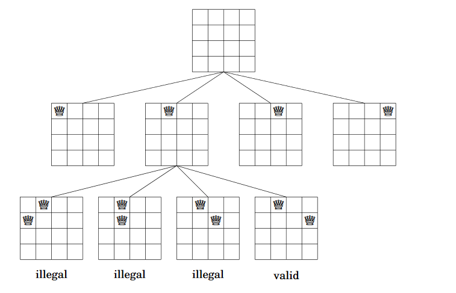
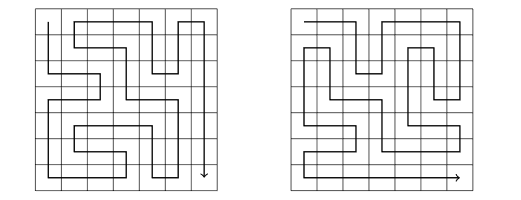

Chapter 5: Complete search
===
 * Complete search can solve almost any problem. 
 * Idea: Generate all possible solutions, select best/count all solutions
 * Alternatives: Backtracking, DP, or Greedy normally

Generating subsets
---
 * Use bits to create subsets! Ex: 11001 is {0, 3, 4}.
 * Or just use the basic method.

Generating permutations
---
 * Use a "chosen" array that keeps track if numbers have been chosen.
 * ~~~c++
	vector<int> permutation;
	for (int i = 0; i < n; i++) {
		permutation.push_back(i);
	}
	do {
		// process permutation
	} while (next_permutation(permutation.begin(),permutation.end()));
   ~~~

Backtracking
---
 * One of my favorite types of algorithms!
 * Generate permutations but if it's invalid, don't keep going. Just return.
 *  
 * Cool way of doing N-queens problem: Use arrays to represent diagonals, rows, and columns so don't have to use weird loop to see if board is valid.
 
Pruning the search
---
 * Optimize backtracking using pruning, like A.I.
 * Ex: Find the number of paths in a 7x7 matrix that visits all squares
	* Optimization 1: There are always two paths that are symmetric.
	* 
	* Optimization 2: Visits goal early, terminate
	* Optimization 3: If hits wall and can turn left or right, stop search.
	* Optimization 4: If just can't go forward and can go left or right, stop.
 * Using these optimizations, time goes from 500s -> .6s

Meet in the middle
---
 * Search space is divided into two halves. Separate searches on each half, then combined.
