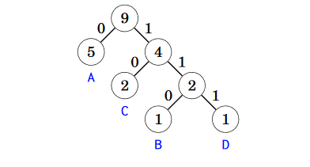

Chapter 6: Greedy algorithms
===
 * Greedy algorithms always take best choice at that moment

Coin problem
---
 * The coin problem is to form a sum of money n using coin values in an array.
 * Greedy Algorithm = Take largest possible coin first
 * With most basic coin problems where values are multiples of eachother, then it is optimal.
 * However, general cases are non-optimal. Ex: Get 6 cents with {1,3,4} cent coins. Optimal = 3+3, solution = 4+1+1
 * DP can be used to solve general case

Scheduling
---
 * Given n events with start and end times, find schedule that fits as many possible.
 * Algorithm 1: Select shortest events first
 * Algorithm 2: Select next possible event that begins as early as possible
 * Algorithm 3: Select next possible event that ends as early possible
 * Algorithm 3 is the only optimal one of the 3.

Tasks and deadlines
---
 * Each task has a duration and deadline. Earn deadline-finish_time points.
 * Always sort by duration of task. Deadline does not matter. Choose lowest duration task first

Minimizing sums
---
 * Find a value x that minimizes the sum |a1-x|c + |a2-x|c + ...
 * For the c = 1 case, choose the median number.
 * For the c = 2 case, use FOIL to find the equation. Turns out the average of the a set is the best.

Data compression
---
 * Use variable length codewords for different letters. Ex: Regularly, A = 00, B = 01, C = 10, D = 11. Make it shorter by doing A = 0, B = 110, C = 10..
 * This requires that no codeword is a prefix of another codeword.

Huffman coding
---
 * To solve data compression problem, use Huffman coding. 
 * Greedy algorithm that constructs optimal code for compressing a given string
 * Build binary tree based on letter frequency
 * When done, LEFT = 0, RIGHT = 1. Each leaf = a letter.
 * 
