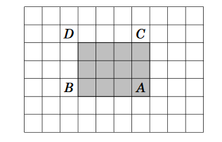
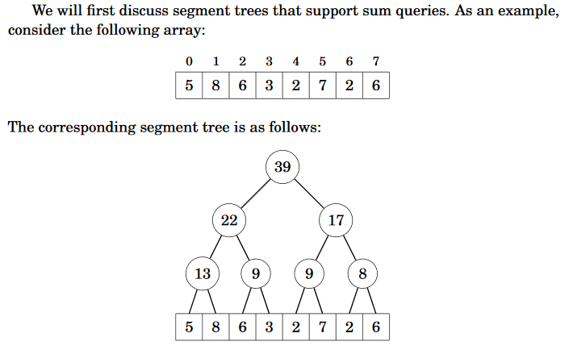

Chapter 9: Range queries
===
 * Discussion of DS that process range queries
 * Range query = calculate value based on subarray of array
 * Ex: Find min between index `a` and index `b`. This is known as a <i>query</i>.

Static array queries
---
 * Static array = array where values are not updated between queries.
 * <b>Sum queries</b>
	* Use prefix sum array! An array that is equal to sum from 0 to n.
	* That way, you can calculate a sum in O(1) by doing `prefix[b] - prefix[a-1]`.
	* Can also be done in 2D.
		*  
		* If point A is bottom right, point D is top left, and prefix[][] is the very top left, then `S(A) - S(B) - S(C) + S(D)` where B and C are other corners.
 * <b>Minimum queries</b>
	* Idea: Precalculate all values of `min(a,b)` where `b - a + 1` is a power of 2. 
	* Precalculations done by: `minq(a, b) = min(minq(a, a+w-1), minq(a+w,b))` where `b-a+1` is a power of 2 and `w` is half of that.
	* Find any query: `min(minq(a, a+k-1), minq(b-k+1,b))`. k is of length where the two `minq` calls overlap, creating a union

Binary indexed tree
---
 * Also known as a Fenwick tree. Dynamic variant of prefix sum array.
 * Allows updating array values in the prefix sum array in O(log n) time instead of O(n) (recreating the prefix sum array).
 * `tree[k] = sumq(k - p(k) + 1, k)` where p(k) is largest power of 2 that divides k.
 * Sums can be easily calculated due to having non-overlapping sums of zones.
 * Use bit operations. p(k) can be easily found by doing `p(k) = k&-k`

Segment tree
---
 * Binary tree so that leaf nodes correspond to array elements. 
 * Supports almost all range queries
 * Use array to create it where `tree[1]` is the root, `tree[2]` is the left child of root, `tree[3]` is right child, and `tree[n]` is the start of the leaves.
 * 
 * Can also be used to find minimums/maximums in O(log n) time.

Additional techniques
---
 * If we want to increase a bunch of elements by x, use a difference array.
 * Difference array = d[i] = a[i] - a[i-1].
 * To update a range, just update a by increasing and b by decreasing.
