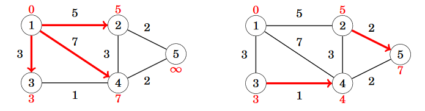
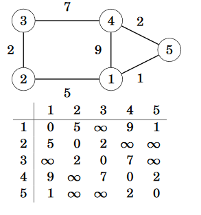

Chapter 13: Shortest paths
===
 * Finding shortest path is incredibly important problem. 
 * In unweighted graphs, we can just use BFS to solve for shortest paths
 * This chapter will focus on weighted graphs

Bellman-Ford algorithm
---
 * Finds paths from starting node to all other nodes
 * Can detect negative cycles, but does not account for it
 * 
 * Implemented fairly easily using two for loops. tie(a,b,w) gets a, b, and w from e.  
 * ~~~c++
	for (int i = 1; i <= n; i++) distance[i] = INF;
	distance[x] = 0;
	for (int i = 1; i <= n-1; i++) {
		for (auto e : edges) {
			int a, b, w;
			tie(a, b, w) = e;
			distance[b] = min(distance[b], distance[a]+w);
		}
	}
   ~~~
 * To detect negative cycle, run `n` rounds instead of `n-1`. If anything decreases, there's a negative cycle.

Dijkstra's algorithm
---
 * Finds paths from starting node to all other nodes
 * More efficient than Bellman-Ford, but harder to implement
 * Requires no negative weights. Similar to BFS in chapter 12.
 * ~~~c++
	for (int i = 1; i <= n; i++) distance[i] = INF;
	distance[x] = 0;
	q.push({0,x});
	while (!q.empty()) {
		int a = q.top().second; 
		q.pop();
		if (processed[a]) continue;
		processed[a] = true;
		for (auto u : adj[a]) {
			int b = u.first, w = u.second;
			if (distance[a]+w < distance[b]) {
				distance[b] = distance[a]+w;
				q.push({-distance[b],b});
			}
		}
	}
   ~~~

Floyd-Warshall algorithm
---
 * Finds all shortest paths in a single run
 * Maintains 2D array that keeps track of distances
 * Initially, filled with infinity for distance it doesn't know (edge count > 1). Example: 
	* 
 * Consists of multiple rounds. Each round, algorithm selects new node that acts as intermediate node in paths.
 * After initial setup, can be done very easily in O(n3). 
 * ~~~c++
	for (int k = 1; k <= n; k++) {
		for (int i = 1; i <= n; i++) {
			for (int j = 1; j <= n; j++) {
				distance[i][j] = min(distance[i][j],distance[i][k]+distance[k][j]);
			}
		}
	}
   ~~~
