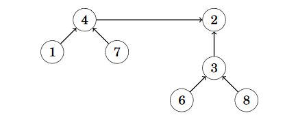

Chapter 15: Spanning trees
===
 * Convert graph into tree w all nodes, some edges
 * Weight = sum of all edge weights
 * Minimum spanning tree (MST) = weight is small as possible

Kruskal's algorithm
---
 * Initial: Only nodes, no edges
 * Sort edge weights, adds edges to tree if no cycle
 * Cycle = two edges already a part of set
 * In order to check if the nodes are already part of the same component, use union-find structure.

Union-find structure
---
 * Union-find struct: Collection of sets that are disjoint
 * Supports uniting two sets together, and finding an element in one of the sets
 * Use representative nodes for each set (representative = root of set tree basically)
 * Join two sets by connecting each representative, smaller set linked to larger set
 * 
 * Keep track of size + links using `size` and `link` arrays. `link` holds index of above element in chain
 * ~~~c++
	int find(int x) {
		while (x != link[x]) x = link[x];
		return x;
	}
	
	bool same(int a, int b) {
		return find(a) == find(b);
	}

	void unite(int a, int b) {
		a = find(a);
		b = find(b);
		if (size[a] < size[b]) swap(a,b);
		size[a] += size[b];
		link[b] = a;
	}
   ~~~ 

Prim's algorithm
---
 * Add random start node to tree. Then, add minimum weight edge that adds a new node to the tree
 * Modify Dijkstra's algorithm for implementation.
